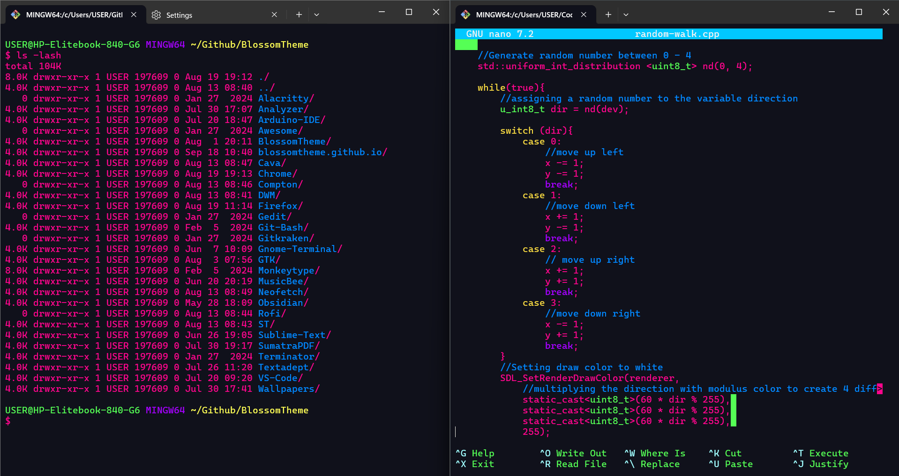

# Blossom Theme for Windows Terminal

## Preview


## Installation
1. Open Windows Terminal and open Settings (ctrl + ,).

2. Click `Open JSON Settings` in the bottom left corner.

3. In the Windows Terminal `settings.json` file, locate the `schemes` section and insert the contents of `blossom.json`.
For example:

```json
"schemes": [
    {
        "name": "Blossom",
        "background": "#10111B",
        "foreground": "#FF058D",
        "black": "#0C0C0C",
        "blue": "#01C8FF",
        "brightBlack": "#767676",
        "brightBlue": "#0187FF",
        "brightCyan": "#76FFF9",
        "brightGreen": "#00FF7D",
        "brightPurple": "#8700D9",
        "brightRed": "#B80034",
        "brightWhite": "#F2F2F2",
        "brightYellow": "#FCDD42",
        "cursorColor": "#FFFFFF",
        "cyan": "#A0FEFF",
        "green": "#55FF55",
        "purple": "#A500FF",
        "red": "#F70047",
        "selectionBackground": "#FFFFFF",
        "white": "#CCCCCC",
        "yellow": "#FFFF55"
    }
]
```

4. Activate : After defining the color scheme, enable it by adding a `colorScheme` value to the default profile in the `profiles` section.
Example:

```json
"profiles": {
    "defaults": {
        "colorScheme" : "Blossom"
    }
}
```

5. If the profiles are listed like this:

```json
"profiles": [
    // list of profiles
]
```

Modify it to:

```json
"profiles": {
    "defaults": {
      "colorScheme": "Blossom"
    },
    "list": [
      // list of profiles
    ]
  },
```

6. Enjoy!
